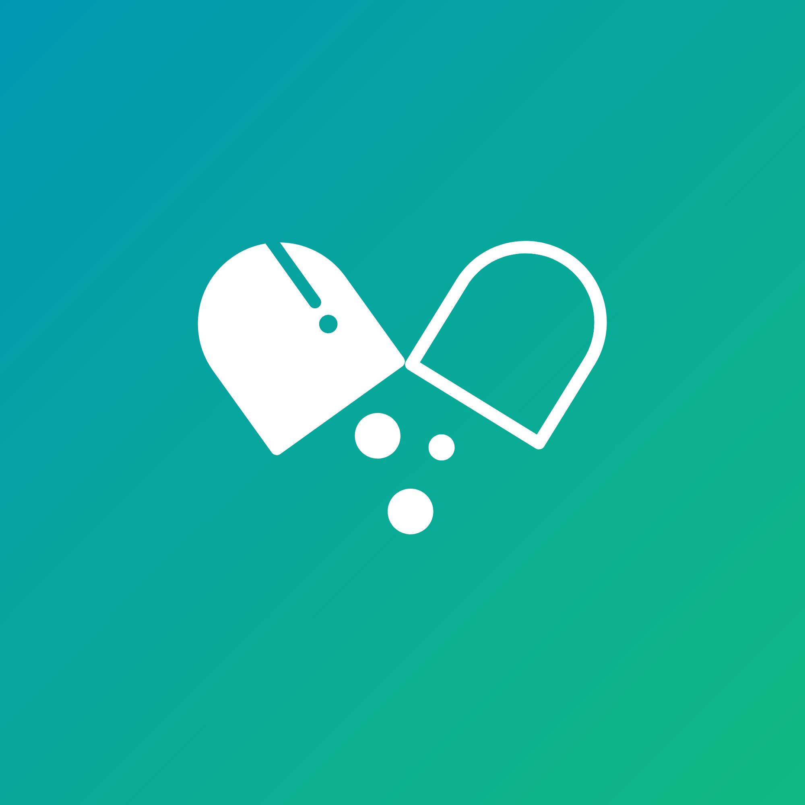
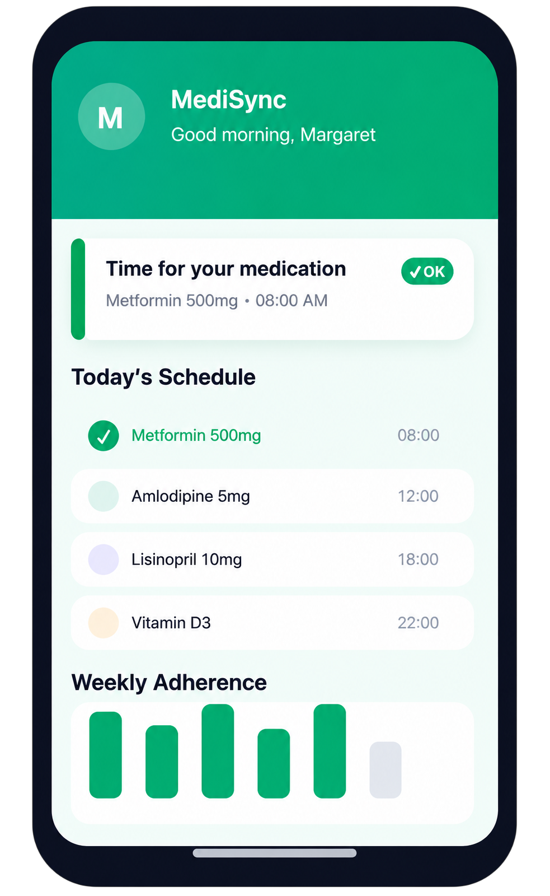
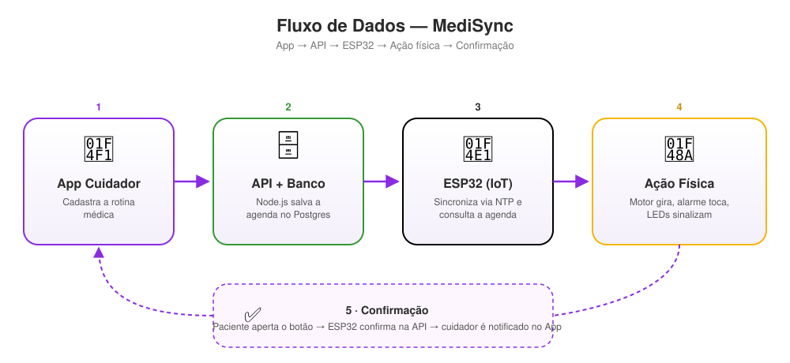

<p align="center">
  
</p>

<h1 align="center">MediSync</h1>

<h4 align="center">
Dispensador Inteligente de Medicamentos integrado a um ecossistema de cuidado e monitoramento.
</h4>

<p align="center">


</p>

<p align="center">
  <a href="https://luisacampanhah.github.io/Hackathon-MediSync/"><b>🌐 Landing Page</b></a> ·
  <a href="https://hackathon-medi-sync-egq36gb65-medi-sync1.vercel.app/"><b>📱 Abrir o App</b></a>
</p>

<p align="center">
<a href="#-o-problema">O Problema</a> •
<a href="#-a-solução">A Solução</a> •
<a href="#-demo">Demo</a> •
<a href="#-arquitetura-do-sistema">Arquitetura</a> •
<a href="#-tecnologias">Tecnologias</a> •
<a href="#-como-executar">Como Executar</a> •
<a href="#-equipe-medisync">Equipe</a>
</p>

---

## 🩺 O Problema

A adesão incorreta a tratamentos medicamentosos é uma das principais causas de **internações evitáveis**, especialmente entre a população idosa. O esquecimento, a confusão com horários e a dosagem errada geram riscos imensos à saúde e sobrecarregam o sistema de saúde.

## 💡 A Solução

O **MediSync** atua como uma ponte entre o paciente e seu cuidador. Nosso ecossistema garante que a medicação seja tomada na hora certa, fornecendo alertas físicos para o paciente e feedback em tempo real para os familiares.

**Alinhamento com os ODS (ONU):**
- **ODS 3:** Saúde e Bem-Estar.
- **ODS 10:** Redução das Desigualdades (Acessibilidade para populações vulneráveis).

---

## 🎬 Demo

| Landing Page | App (Cuidador) |
|:---:|:---:|
| [luisacampanhah.github.io/Hackathon-MediSync](https://luisacampanhah.github.io/Hackathon-MediSync/) | [hackathon-medi-sync.vercel.app](https://hackathon-medi-sync.vercel.app/) |

<p align="center">
  
</p>

---

## 🏗️ Arquitetura do Sistema

O fluxo de dados foi desenhado para ser resiliente e autônomo:

<p align="center">
  
</p>

1. **App (Cuidador):** Cadastra a rotina médica. A API salva no banco de dados.
2. **IoT (ESP32):** Sincroniza via NTP e consulta o servidor (`polling`) para buscar a agenda do dia.
3. **Ação Física:** No horário programado, o motor gira, o alarme toca e os LEDs sinalizam.
4. **Confirmação:** O paciente aperta o botão físico. O ESP32 envia a confirmação para a API, que notifica o cuidador pelo App.

---

## ⚙️ Tecnologias

A stack escolhida visa performance, facilidade de prototipação e estabilidade:

### Hardware (IoT)
- **Placa:** ESP32 (Wi-Fi integrado)
- **Linguagem:** C++ (Arduino Framework)
- **Bibliotecas:** `ESP32Servo`, `ArduinoJson`, `HTTPClient`

### Frontend (Mobile)
- **Framework:** React Native / Expo
- **Linguagem:** TypeScript
- **Estilização:** Tamagui
- **Recursos:** Notificações Push, Gráficos de Adesão

### Backend (API)
- **Ambiente:** Node.js
- **Banco de Dados:** PostgreSQL (via Docker)
- **Arquitetura:** REST API

### Landing Page
- HTML, CSS e JavaScript puro — publicada automaticamente via GitHub Actions (`.github/workflows/deploy-pages.yml`) sempre que a pasta `Landing Page/` muda na branch `main`.

---

## 🚀 Como Executar

Clone o projeto para a sua máquina local:

```bash
git clone https://github.com/LuisaCampanhaH/Hackathon-MediSync.git
cd Hackathon-MediSync
```

### 1. Inicializando o Backend

```bash
cd BackEnd
cp .env.example .env   # Edite com suas configurações
docker compose up -d   # Inicia o banco de dados
npm install
npm run dev
```

### 2. Inicializando o Frontend

```bash
cd FrontEnd
cp .env.example .env   # Edite EXPO_PUBLIC_API_URL com o IP da sua rede
npm install
npx expo start
```

### 3. Configurando o Hardware

1. Abra a pasta `HardWare/`.
2. Duplique o arquivo `secrets.h`.
3. Insira suas credenciais de Wi-Fi e o IP onde o servidor Backend está rodando.
4. Compile e faça o upload de `dispensador_integrado_backend.ino` para o ESP32 usando a Arduino IDE.

> **Nota de Segurança:** Os arquivos `.env` e `secrets.h` estão no `.gitignore` para proteger dados sensíveis.

---

## 📁 Estrutura do Repositório

```
Hackathon-MediSync/
├── Landing Page/     # Site estático (publicado no GitHub Pages)
├── FrontEnd/         # App React Native / Expo (publicado no Vercel)
├── BackEnd/          # API Node.js + PostgreSQL
├── HardWare/         # Firmware ESP32 (Arduino/C++)
└── assets/readme/    # Imagens e diagramas usados neste README
```

---

## 👥 Equipe MediSync

Desenvolvido com ☕ durante o Hackathon.

| Função | Nome |
| :--- | :--- |
| **Hardware / Firmware C++** | Luisa |
| **Backend / API / BD** | Fernando |
| **Frontend / UI / UX** | Luan |
| **Pesquisa / Pitch / Relatório** | Thayna |

<br>

<p align="center">
Feito para transformar o cuidado com a saúde. 💙
</p>
